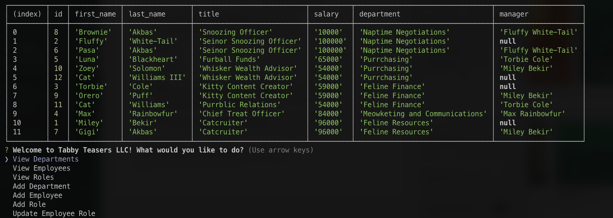

# Tamer - SQL Employee Tracker

## Description 
This application allows a company to keep track of their employees, their roles/titles, their departments, as well as their salaries and managers using MySQL within a users command terminal. The Employee Tracker gives the user the ability to view all of their data, such as all of their employees, departments and roles/titles. Using the Employee Tracker, a user is able to change the role of an employee, create a new employees and assign them a role and department as well the option to make them a manager or assign them one.

# Table of Contents
- [Installation](#installation)
- [License](#license)
- [Screenshot](#screenshot)
- [Video Demo](#video-demo)
- [Features](#features)
- [Questions](#questions)

## Installation 
Requirements to use application: <a href=“https://dev.mysql.com/downloads/installer/“>MySQL</a>, <a href=“https://nodejs.org/en/“>NodeJs</a> and <a href=“https://www.npmjs.com/package/inquirer“>npm inquirer</a>.

In order to use this application, the user must fork and/or clone over the repo once required packages are installed. Once the user has the repo set up on their location machine, follow the steps below.

1 - Open the command terminal on index.js

2 - Run command ``npm I inquirer@8.4.2`` to install packages.

3 - Run command node ``index.js`` to run the application.

## Screenshot

## Video-Demo

## Features
<a href=“https://www.npmjs.com/package/inquirer/v/8.2.4”>npm inquirer</a> - <a href="https://nodejs.org/docs/latest/api/
">NodeJs</a> - <a href="https://dev.mysql.com/downloads/installer/">MySQL</a>

## Questions
<a href="https://github.com/tamerbekir">My GitHub</a>
 
If you have any questions or inquiries, feel free to contact me using my <a href="mailto:tamerbekir@yahoo.com">email</a>

This README.md was generated by <a href="https://www.linkedin.com/in/tam-b-53815035/">Tamer Bekir</a> using Node.js.

## License

This project is covered under the [MIT License](https://opensource.org/blog/license/mit) License

